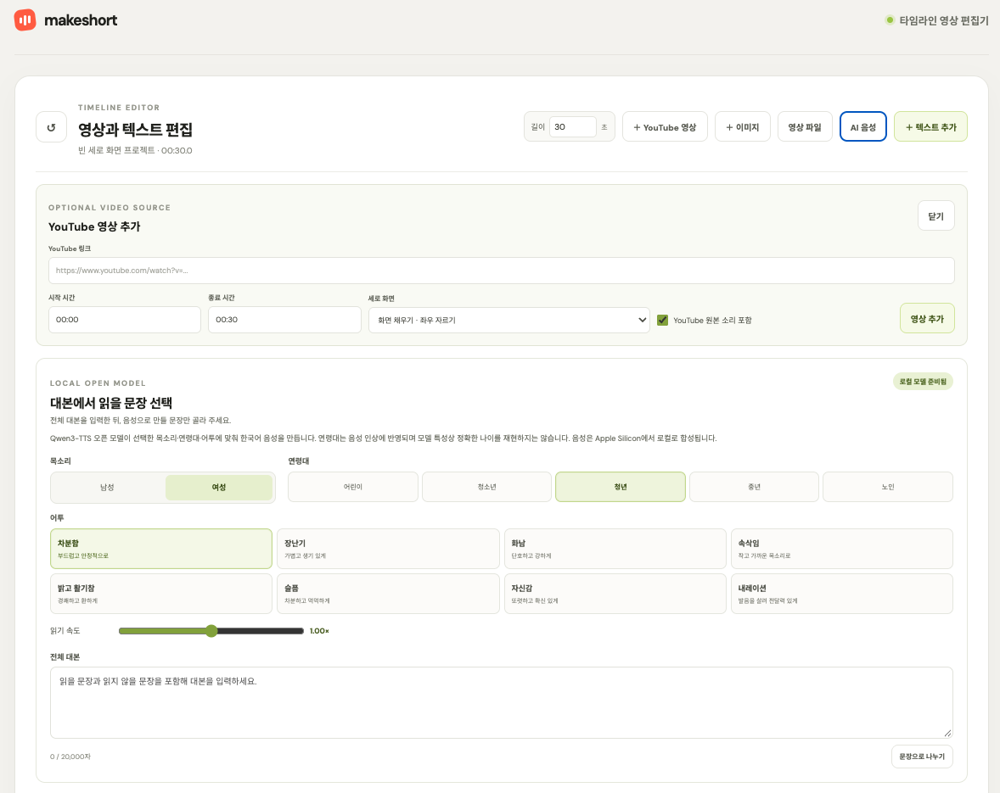
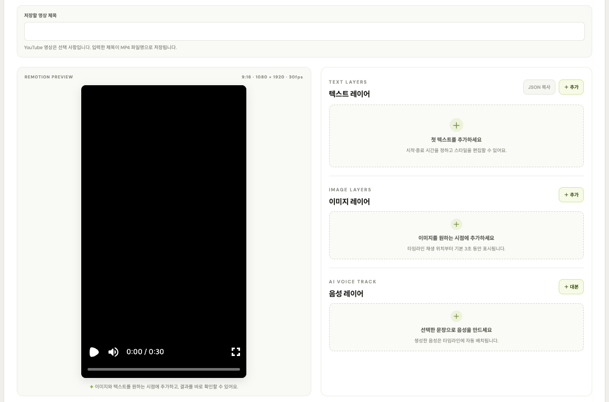
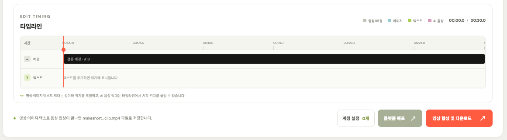

# MakeShort

[English](README.md)

MakeShort는 YouTube 클립, 이미지, 자막, 음성을 타임라인에서 편집해 세로형 MP4로 내보내는 로컬 웹 앱입니다. YouTube 영상은 선택 사항입니다. 앱 인터페이스는 브라우저 언어 설정을 따릅니다. 브라우저가 한국어면 한국어로, 그 외에는 영어로 표시합니다.

### 화면 미리보기

편집 화면을 위에서부터 순서대로 캡처했습니다.

**1. 영상 소스와 AI 음성** — YouTube 구간을 선택적으로 추가하고, 목소리·연령대·어투·읽기 속도를 정한 뒤 대본에서 음성으로 만들 문장을 고릅니다.



**2. Remotion 미리보기와 레이어** — 세로 영상 미리보기와 텍스트·이미지·음성 레이어를 확인하고 편집합니다.



**3. 타임라인과 내보내기** — 레이어의 시간과 위치를 조정하고 합성 결과를 다운로드하거나 배포합니다.



### 로컬에서 실행

필요 항목: Python 3.10+, Node.js, FFmpeg. macOS에서는 `brew install ffmpeg`로 설치할 수 있습니다.

```bash
python3.13 -m venv .venv
source .venv/bin/activate
python -m pip install -r requirements.txt
npm install
npm run build
python app.py
```

<http://127.0.0.1:8000>을 엽니다.

### 편집 및 내보내기

- 빈 9:16 타임라인에 텍스트와 이미지·MP4·MOV 파일을 배치하거나 YouTube 클립을 추가합니다.
- 화면 채우기(`fill`)로 좌우를 자르거나, 검은 여백을 넣고 전체 영상을 맞추는(`fit`) 방식을 선택합니다.
- Remotion 미리보기에서 자막의 내용·시간·위치·상자 크기·폰트·색상·애니메이션·효과를 조절합니다. 자막을 드래그해 위치를 미세 조정하거나 스타일 preset을 선택할 수 있습니다.
- 대본에서 선택한 문장만 AI 음성으로 생성합니다. 남성·여성 목소리와 연령대, 8개 어투 preset, 읽기 속도를 설정하고 타임라인에서 음성 클립을 편집합니다. 생성된 음성마다 자막이 함께 만들어지고 자막 시간은 음성 클립을 따라갑니다. 음성 클립별로 자막 표시를 켜거나 끌 수 있습니다.
- 1080 × 1920 H.264 MP4로 내보냅니다. YouTube 클립은 원본 프레임레이트를 유지합니다.

### Qwen 음성 모델

AI 음성 생성은 Apple Silicon과 Python 3.12 환경에서 `Qwen/Qwen3-TTS-12Hz-1.7B-CustomVoice`를 사용합니다. 모델은 약 4.2GB이며 설치 후 음성 생성은 로컬에서 처리됩니다.

기존 환경을 다음 순서로 자동 검색합니다: `makeshort/.venv-qwen`, `../lecture_short_video_generator/.venv-qwen`, 시스템 Python. Hugging Face 기본 캐시에 모델이 있으면 다시 다운로드하지 않습니다. Python 경로를 직접 지정하려면 `QWEN_TTS_PYTHON=/path/to/python python app.py`로 실행합니다.

새 환경과 모델 설치:

```bash
python3.12 -m venv .venv-qwen
.venv-qwen/bin/python -m pip install --upgrade pip
.venv-qwen/bin/python -m pip install -r requirements-voice.txt
.venv-qwen/bin/python -c 'from huggingface_hub import snapshot_download; snapshot_download(repo_id="Qwen/Qwen3-TTS-12Hz-1.7B-CustomVoice")'
QWEN_TTS_PYTHON="$PWD/.venv-qwen/bin/python" python app.py
```

패키지와 모델을 내려받을 때는 인터넷이 필요합니다. 기본 캐시는 `~/.cache/huggingface/hub`입니다. 다른 위치를 사용한다면 다운로드와 앱 실행에 같은 `HF_HOME` 또는 `HF_HUB_CACHE`를 지정합니다. 편집기의 **AI 음성** 패널에서 모델 상태를 확인할 수 있습니다.

### JSON 영상 합성 API

YouTube 구간, 자막, 선택적으로 읽을 문장을 JSON으로 만들어 `POST http://127.0.0.1:8000/api/create`로 보내면 AI 음성 생성과 Remotion 합성을 거쳐 MP4를 반환합니다. AI 음성 생성에는 로컬 Qwen 모델이 설치되어 있어야 합니다.

*Night of the Living Dead* 영어 내레이션 예제: [요청 JSON](examples/night_of_the_living_dead.json) · [전체 영상 (MP4)](examples/night_of_the_living_dead_english_1h24.mp4). 아래는 첫 5초 무음 GIF 미리보기이며 클릭하면 전체 영상을 엽니다.

[](examples/night_of_the_living_dead_english_1h24.mp4)

요청 JSON 예제:

```json
{
  "url": "https://www.youtube.com/watch?v=f5_wn8mexmM",
  "start": "01:23", "end": "01:35", "title": "공연 하이라이트",
  "mode": "fit", "include_audio": true,
  "source_volume": 0.8, "duck_source_during_voiceover": true,
  "captions": [{
    "text": "하이라이트", "start": 0, "end": 8,
    "position": "bottom-center", "positionX": 50, "positionY": 88,
    "boxWidth": 84, "boxHeight": 10,
    "font": "do-hyeon", "fontSize": 72, "color": "#ffffff",
    "animation": "pop", "decoration": "outline"
  }],
  "voiceovers": [{
    "text": "지금부터 공연의 하이라이트를 소개합니다.",
    "start": 2.5, "gender": "female", "age_group": "young_adult", "tone": "narration",
    "language": "Korean",
    "speed": 1.0, "volume": 1.0
  }]
}
```

`start`와 `end`는 원본 영상 시간이고, 자막과 AI 음성의 `start`는 클립 시작 기준 초입니다. `voiceovers`에는 읽을 문장만 넣으며 음성 길이는 생성 후 자동 계산됩니다. `language`는 `Korean` 또는 `English`이며 생략하면 한국어입니다. 목소리 `gender`는 `male` 또는 `female`, `age_group`은 `child`, `teen`, `young_adult`, `middle_aged`, `senior` 중 하나이며 생략하면 `young_adult`입니다. 연령대는 음성 인상을 조정하며 정확한 나이를 재현하지 않습니다. `tone`은 `calm`, `playful`, `angry`, `whisper`, `bright`, `sad`, `confident`, `narration` 중 하나입니다. `speed`는 0.7~1.3, 트랙 `volume`은 0~1이며 둘 다 기본값은 1입니다. 음성을 끝까지 포함하도록 필요하면 출력 길이가 늘어납니다. `duck_source_during_voiceover`가 `true`이면 AI 음성이 재생되는 동안 원본 소리를 설정 음량의 20%까지 낮춥니다. `source_volume` 기본값은 1, `include_audio`는 `true`, `mode`는 `fill` 또는 `fit`입니다. 자막 `end`를 생략하면 클립 끝까지 표시하고 `title`을 생략하면 YouTube 제목을 파일명으로 사용합니다. 위치와 텍스트 상자 크기는 화면 기준 퍼센트입니다.

폰트 ID: `noto`, `black-han`, `serif`, `do-hyeon`, `gowun-dodum`, `gowun-batang`, `nanum-gothic`, `system`. 애니메이션: `none`, `fade`, `pop`, `typewriter`. 효과: `none`, `shadow`, `outline`, `box`. Do Hyeon, Gowun Dodum, Gowun Batang, Nanum Gothic은 SIL Open Font License로 제공됩니다([라이선스 정보](https://github.com/google/fonts/tree/main/ofl)). Google Fonts에 연결할 수 없으면 시스템 폰트로 대체됩니다.

```bash
curl --fail --request POST http://127.0.0.1:8000/api/create \
  --header 'Content-Type: application/json' \
  --data-binary @request.json \
  --remote-header-name --remote-name
```

요청은 256KB 이하, 클립은 최대 1시간, 자막은 최대 120개입니다. 오류 응답은 `{"error":"..."}` 형식입니다.

### Shorts·Reels·TikTok 배포

편집 화면 **계정 설정**에서 개발자 앱 자격 증명을 입력하거나 프로젝트 루트의 `.env.local`에 환경 변수를 설정한 뒤 계정을 연결합니다. 환경 변수는 앱 시작 시 읽으며 UI에 저장한 값보다 우선합니다. 값을 바꾼 뒤 앱을 다시 시작하세요.

`.env.local` 예제 (Git에서 제외됩니다):

```dotenv
MAKESHORT_YOUTUBE_CLIENT_ID=your-google-oauth-client-id
MAKESHORT_YOUTUBE_CLIENT_SECRET=your-google-oauth-client-secret

MAKESHORT_INSTAGRAM_APP_ID=your-meta-app-id
MAKESHORT_INSTAGRAM_APP_SECRET=your-meta-app-secret

MAKESHORT_TIKTOK_CLIENT_KEY=your-tiktok-client-key
MAKESHORT_TIKTOK_CLIENT_SECRET=your-tiktok-client-secret
```

각 플랫폼에는 앱 키 한 세트면 됩니다. 같은 플랫폼에 여러 계정을 연결할 수 있습니다. 계정별 OAuth 토큰은 macOS 키체인에 저장되고, 계정 목록과 배포 그룹은 `~/.makeshort/accounts.json`에서 관리합니다. 환경 변수를 사용하지 않으면 계정 설정에서 앱 키를 저장할 수 있습니다.

| 플랫폼 | 앱 및 계정 요구 사항 | Callback URL |
| --- | --- | --- |
| YouTube Shorts | [Google Cloud](https://console.cloud.google.com/) · YouTube Data API v3 | `http://127.0.0.1:8000/oauth/youtube/callback` |
| Instagram Reels | [Meta for Developers](https://developers.facebook.com/) · Instagram Graph API, Facebook Page에 연결된 Business/Creator 계정 | `http://127.0.0.1:8000/oauth/instagram/callback` |
| TikTok | [TikTok for Developers](https://developers.tiktok.com/) · Login Kit, Content Posting API | `http://127.0.0.1:8000/oauth/tiktok/callback` |

같은 플랫폼 계정을 여러 개 연결할 수 있습니다. **계정 설정 → 배포 그룹**에서 그룹을 만들고 플랫폼별 게시 계정을 지정하세요. 배포 창에서 그룹을 선택하면 해당 계정에 게시합니다. 예를 들어 음악 그룹에는 YouTube A·Instagram A·TikTok A를, 영화 그룹에는 각 플랫폼의 B 계정을 지정할 수 있습니다. 계정 연결을 해제하면 그룹에서도 해당 계정이 빠집니다.

플랫폼 앱 검수와 권한 승인이 필요할 수 있습니다. 계정 설정에서 저장한 앱 Secret과 계정별 토큰은 macOS 키체인에 보관하고, `.env.local`의 앱 키는 해당 파일에서 읽습니다. 계정 및 그룹 설정은 `~/.makeshort/accounts.json`에 권한 `0600`으로 저장합니다. `.env.local`은 Git에서 제외되지만 평문 파일이므로 안전하게 보관하세요. 게시 전 확인을 마치면 YouTube에는 비공개로, TikTok에는 `SELF_ONLY`로 게시합니다. Instagram 게시물은 게시 완료 후 공개됩니다.
