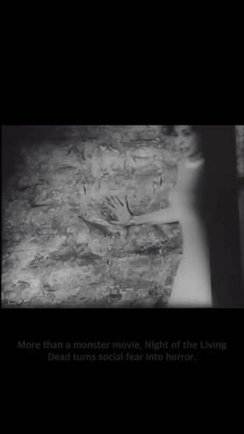

# MakeShort

YouTube 영상, 이미지, 자막, 음성을 타임라인에서 편집해 세로형 MP4로 내보내는 로컬 웹 앱입니다. YouTube 영상은 선택 사항입니다.

## 실행

필요 항목: Python 3.10+, Node.js, FFmpeg. macOS에서는 `brew install ffmpeg`로 설치할 수 있습니다.

```bash
python3.13 -m venv .venv
source .venv/bin/activate
python -m pip install -r requirements.txt
npm install
npm run build
python app.py
```

<http://127.0.0.1:8000>을 엽니다.

## 편집 및 내보내기

- 빈 9:16 타임라인에 텍스트와 이미지·MP4·MOV 파일을 배치하거나 YouTube 클립을 추가합니다.
- 영상 맞춤은 화면 채우기(`fill`) 또는 검은 여백과 함께 전체 영상 담기(`fit`)를 선택합니다.
- Remotion 미리보기에서 자막의 내용·시간·위치·상자 크기·폰트·색상·애니메이션·효과를 조절합니다. 위치는 드래그할 수 있고 스타일 preset도 제공합니다.
- AI 음성은 대본에서 선택한 문장만 생성합니다. 남성·여성 목소리, 8개 말투 preset, 읽기 속도를 설정하고 음성 클립을 타임라인에서 편집합니다.
- 출력은 1080 × 1920 H.264 MP4이며 YouTube 클립의 원본 프레임레이트를 유지합니다.

## Qwen 음성 모델

AI 음성은 Apple Silicon과 Python 3.12 환경에서 `Qwen/Qwen3-TTS-12Hz-1.7B-CustomVoice`를 사용합니다. 모델은 약 4.2GB이며, 한 번 설치하면 음성 생성은 로컬에서 처리됩니다.

기존 환경은 자동 검색합니다: `makeshort/.venv-qwen`, `../lecture_short_video_generator/.venv-qwen`, 시스템 Python 순입니다. Hugging Face 기본 캐시에 모델이 있으면 재다운로드하지 않습니다. 경로를 직접 지정하려면 `QWEN_TTS_PYTHON=/path/to/python python app.py`로 실행합니다.

새 환경과 모델 설치:

```bash
python3.12 -m venv .venv-qwen
.venv-qwen/bin/python -m pip install --upgrade pip
.venv-qwen/bin/python -m pip install -r requirements-voice.txt
.venv-qwen/bin/python -c 'from huggingface_hub import snapshot_download; snapshot_download(repo_id="Qwen/Qwen3-TTS-12Hz-1.7B-CustomVoice")'
QWEN_TTS_PYTHON="$PWD/.venv-qwen/bin/python" python app.py
```

패키지와 모델을 받을 때는 인터넷이 필요합니다. 기본 캐시는 `~/.cache/huggingface/hub`입니다. 다른 위치를 사용하면 다운로드와 실행 모두 같은 `HF_HOME` 또는 `HF_HUB_CACHE`를 지정합니다. 모델 상태는 편집기의 **AI 음성** 패널에서 확인할 수 있습니다.

## JSON 합성 API

`POST http://127.0.0.1:8000/api/create`에 YouTube 구간, 자막, 선택적으로 읽을 문장을 JSON으로 보내면 AI 음성 생성과 Remotion 합성을 거친 MP4를 반환합니다. AI 음성 생성에는 로컬 Qwen 모델이 설치되어 있어야 합니다.

영어 내레이션을 생성하는 영화 소개 예제: [요청 JSON](examples/night_of_the_living_dead.json) · [전체 영상 (MP4)](examples/night_of_the_living_dead_english_1h24.mp4). 아래 미리보기는 첫 5초의 무음 GIF이며, 클릭하면 전체 영상이 열립니다.

[](examples/night_of_the_living_dead_english_1h24.mp4)

```json
{
  "url": "https://www.youtube.com/watch?v=f5_wn8mexmM",
  "start": "01:23", "end": "01:35", "title": "공연 하이라이트",
  "mode": "fit", "include_audio": true,
  "source_volume": 0.8, "duck_source_during_voiceover": true,
  "captions": [{
    "text": "하이라이트", "start": 0, "end": 8,
    "position": "bottom-center", "positionX": 50, "positionY": 88,
    "boxWidth": 84, "boxHeight": 10,
    "font": "do-hyeon", "fontSize": 72, "color": "#ffffff",
    "animation": "pop", "decoration": "outline"
  }],
  "voiceovers": [{
    "text": "지금부터 공연의 하이라이트를 소개합니다.",
    "start": 2.5, "gender": "female", "tone": "narration",
    "language": "Korean",
    "speed": 1.0, "volume": 1.0
  }]
}
```

`start`·`end`는 원본 영상 시간, 자막과 AI 음성 `start`는 클립 시작 기준 초입니다. `voiceovers`에는 읽을 문장만 넣으며, 음성 길이는 생성 후 자동으로 계산됩니다. `language`는 `Korean` 또는 `English`이고 생략 시 한국어입니다. 목소리 `gender`는 `male` 또는 `female`, `tone`은 `calm`, `playful`, `angry`, `whisper`, `bright`, `sad`, `confident`, `narration` 중 하나입니다. `speed`와 트랙 `volume`은 각각 0.7~1.3, 0~1이며 생략 시 1입니다. 음성이 끝까지 포함되도록 필요한 경우 출력 길이가 늘어납니다. `duck_source_during_voiceover`가 `true`이면 AI 음성 구간에 원본 소리를 설정 음량의 20%까지 자동으로 낮춥니다. `source_volume` 기본값은 1, `include_audio` 기본값은 `true`; `mode`는 `fill` 또는 `fit`입니다. 자막 `end`를 생략하면 클립 끝까지 표시하고, `title`을 생략하면 YouTube 제목을 파일명으로 사용합니다. 위치 좌표와 상자 크기는 화면 기준 퍼센트입니다.

폰트 ID: `noto`, `black-han`, `serif`, `do-hyeon`, `gowun-dodum`, `gowun-batang`, `nanum-gothic`, `system`. 애니메이션: `none`, `fade`, `pop`, `typewriter`. 효과: `none`, `shadow`, `outline`, `box`. Do Hyeon, Gowun Dodum, Gowun Batang, Nanum Gothic은 SIL Open Font License로 제공됩니다([라이선스 정보](https://github.com/google/fonts/tree/main/ofl)). Google Fonts 접속이 안 되면 시스템 폰트로 대체됩니다.

```bash
curl --fail --request POST http://127.0.0.1:8000/api/create \
  --header 'Content-Type: application/json' \
  --data-binary @request.json \
  --remote-header-name --remote-name
```

요청은 256KB 이하, 클립은 최대 1시간, 자막은 최대 120개입니다. 오류 응답은 `{"error":"..."}` 형식입니다.

## Shorts·Reels·TikTok 배포

편집 화면의 **계정 설정**에서 개발자 앱 자격 증명을 입력하고 계정을 연결합니다. callback URL을 해당 플랫폼 앱에 등록하세요.

| 플랫폼 | 필요 앱·계정 | callback URL |
| --- | --- | --- |
| YouTube Shorts | [Google Cloud](https://console.cloud.google.com/) · YouTube Data API v3 | `http://127.0.0.1:8000/oauth/youtube/callback` |
| Instagram Reels | [Meta for Developers](https://developers.facebook.com/) · Instagram Graph API, Facebook Page에 연결된 Business/Creator 계정 | `http://127.0.0.1:8000/oauth/instagram/callback` |
| TikTok | [TikTok for Developers](https://developers.tiktok.com/) · Login Kit, Content Posting API | `http://127.0.0.1:8000/oauth/tiktok/callback` |

플랫폼의 앱 검수와 권한 승인이 필요할 수 있습니다. 앱 Secret과 토큰은 macOS 키체인에 저장하고, 계정/Page 정보는 `~/.makeshort/accounts.json`(권한 `0600`)에 저장합니다. 게시 확인 후 YouTube는 비공개, TikTok은 `SELF_ONLY`로 게시합니다. Instagram은 게시 완료 후 계정에 공개됩니다.
